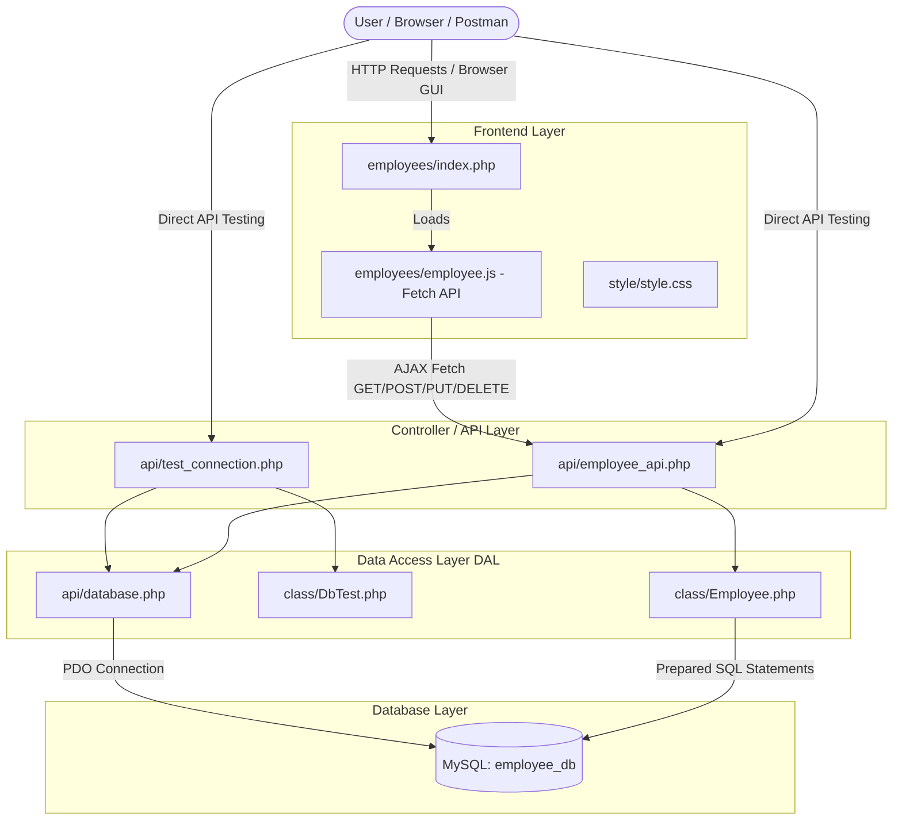
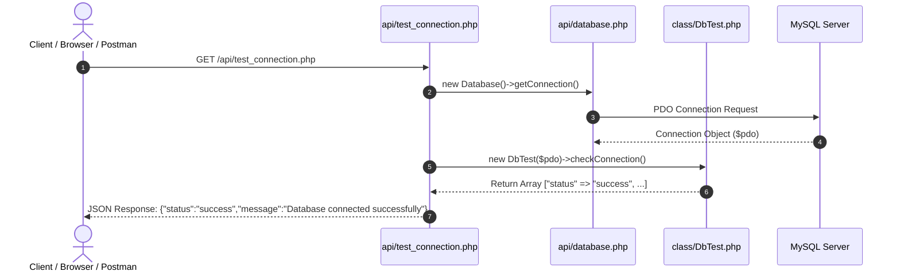
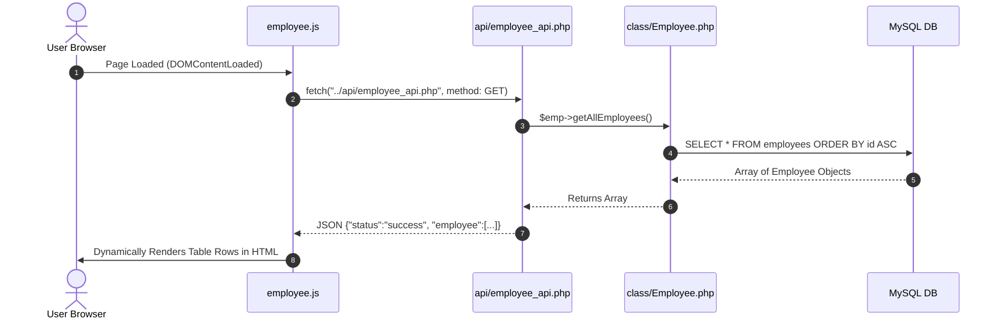
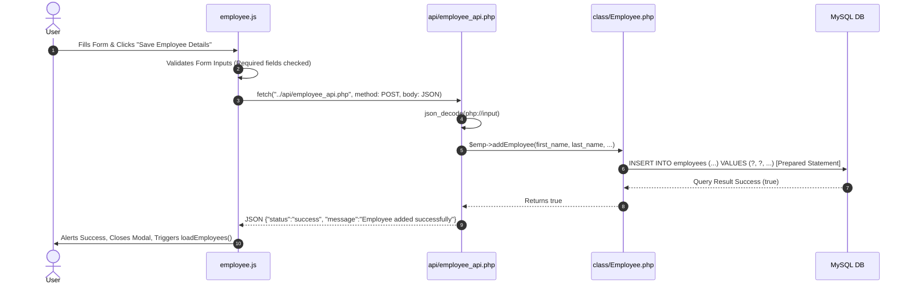
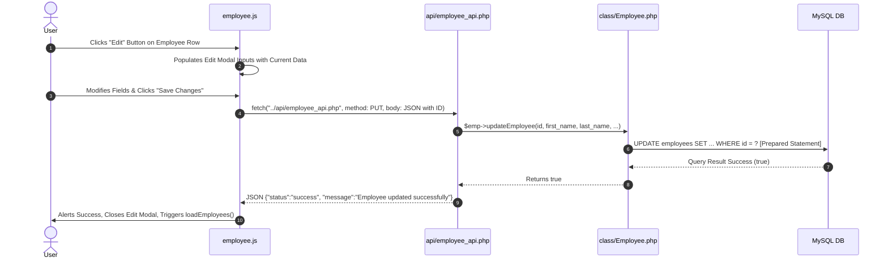
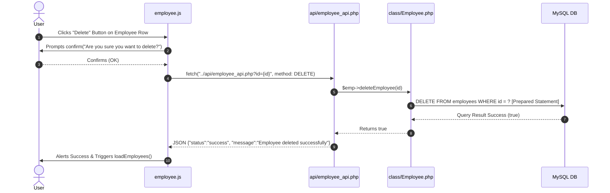

# Employee Management System - Full System Workflow Documentation

This document provides a detailed walkthrough of the **Employee Management System**, including system architecture, component interactions, database schema, REST API specifications, AJAX data flow, and step-by-step testing instructions.

---

## 1. System Architecture & Component Diagram

The application is built using a classic 3-Tier Web Architecture:



---

## 2. File & Directory Structure

```
ads_project_management_employee_systemaljon/
│
├── api/
│   ├── database.php          # PDO connection handler for MySQL
│   ├── test_connection.php   # Health check API returning JSON status
│   └── employee_api.php      # Central RESTful API endpoint (GET, POST, PUT, DELETE)
│
├── class/
│   ├── DbTest.php            # Helper class to test database connectivity
│   └── Employee.php          # Data Access Layer (DAL) executing PDO prepared queries
│
├── employees/
│   ├── index.php             # Main Web GUI interface (HTML + PHP)
│   └── employee.js           # AJAX engine managing Fetch API & dynamic UI updates
│
├── javascript/
│   └── functions.js          # Reusable JavaScript helper utilities
│
├── style/
│   └── style.css             # Main stylesheet for responsive UI design
│
├── screenshots/              # Folder containing visual testing screenshots
├── schema.sql                # SQL initialization script for database and seed data
└── index.php                 # Root entry redirecting to employees/index.php
```

---

## 3. Database Schema (`employee_db`)

The application connects to a MySQL database named `employee_db` containing the `employees` table:

```sql
CREATE DATABASE IF NOT EXISTS employee_db;
USE employee_db;

CREATE TABLE IF NOT EXISTS employees (
    id INT AUTO_INCREMENT PRIMARY KEY,
    first_name VARCHAR(50) NOT NULL,
    last_name VARCHAR(50) NOT NULL,
    middle_initial CHAR(1),
    mobile_number VARCHAR(15) NOT NULL UNIQUE,
    email VARCHAR(100) NOT NULL UNIQUE,
    sex ENUM('Male', 'Female') NOT NULL,
    job_title VARCHAR(100) NOT NULL,
    created_at TIMESTAMP DEFAULT CURRENT_TIMESTAMP
);
```

---

## 4. Full Data Workflows & End-to-End Execution Sequence

### Workflow A: Database Health Check Flow


---

### Workflow B: Retrieve Employees (GET)


---

### Workflow C: Add Employee (POST)


---

### Workflow D: Update Employee (PUT)


---

### Workflow E: Delete Employee (DELETE)


---

## 5. Postman REST API Reference & Request Payloads

| HTTP Method | API Endpoint | Query Params / Headers | Request Body (JSON) | Sample JSON Response |
| :--- | :--- | :--- | :--- | :--- |
| **GET** | `/api/test_connection.php` | None | None | `{"status":"success","message":"Database connected successfully"}` |
| **GET** | `/api/employee_api.php` | None | None | `{"status":"success","employee":[{"id":"1","first_name":"John",...}]}` |
| **GET** | `/api/employee_api.php` | `?id=3` | None | `{"status":"success","employee":[{"id":"3","first_name":"James",...}]}` |
| **POST** | `/api/employee_api.php` | Header: `Content-Type: application/json` | `{"first_name":"Michael","last_name":"Scott","middle_initial":"G","mobile_number":"09991112233","email":"michael.scott@example.com","sex":"Male","job_title":"HR Manager"}` | `{"status":"success","message":"Employee added successfully"}` |
| **PUT** | `/api/employee_api.php` | Header: `Content-Type: application/json` | `{"id":2,"first_name":"Jane","last_name":"Doe","middle_initial":"M","mobile_number":"09234567890","email":"jane.doe@example.com","sex":"Female","job_title":"Business Analyst"}` | `{"status":"success","message":"Employee updated successfully"}` |
| **DELETE** | `/api/employee_api.php` | `?id=5` | None | `{"status":"success","message":"Employee deleted successfully"}` |

---

## 6. How to Run and Test the Application

1. **Start XAMPP**:
   - Open **XAMPP Control Panel**.
   - Start **Apache** and **MySQL** services.

2. **Database Setup**:
   - Import `schema.sql` into MySQL using phpMyAdmin (`http://localhost/phpmyadmin`) or MySQL CLI:
     ```bash
     mysql -u root < schema.sql
     ```

3. **Open Web Application**:
   - Navigate to `http://localhost/ads_project_management_employee_systemaljon/` in any browser.

4. **API Endpoint Testing in Postman**:
   - Open Postman, enter any endpoint URL listed above, set the HTTP method and raw JSON payload (for POST/PUT), and click **Send**.
